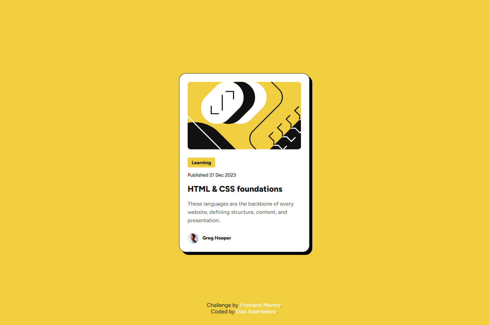

# Frontend Mentor - Blog preview card solution

This is a solution to the [Blog preview card challenge on Frontend Mentor](https://www.frontendmentor.io/challenges/blog-preview-card-ckPaj01IcS). Frontend Mentor challenges help you improve your coding skills by building realistic projects.

## Table of contents

- [Overview](#overview)
  - [The challenge](#the-challenge)
  - [Screenshot](#screenshot)
  - [Links](#links)
- [My process](#my-process)
  - [Built with](#built-with)
  - [What I learned](#what-i-learned)
  - [Continued development](#continued-development)
  - [Useful resources](#useful-resources)
- [Author](#author)

# Blog Preview Card Component

## Overview

### The challenge

The challenge was to create a responsive blog preview card component that:

- Displays a preview of an article with an image, category, publication date, title, description, and author information.
- Works seamlessly across different screen sizes.
- Is accessible and follows modern best practices.

### Screenshot



### Links

- Live Site URL: [Add your live site URL here](#)
- Solution URL: [Add your solution repository URL here](#)

---

## My process

### Built with

- Semantic HTML5
- CSS custom properties
- Flexbox for layout
- Responsive design principles
- Accessible and keyboard-friendly navigation

### What I learned

While building this project, I gained experience with:

1. **CSS Variables**: I used variables to define reusable styles for colors, spacing, and font sizes, making the code easier to maintain and update.
2. **Responsive Design**: Ensuring the card is visually appealing and functional on screens as small as 375px.
3. **Accessibility Improvements**:
   - Added `aria-labels` for better screen reader support.
   - Used focus-visible styles to enhance keyboard navigation.
   - Implemented a skip link to allow users to jump directly to the main content.

**Example:**

```css
.skip-link {
  position: absolute;
  left: 1rem;
  top: 1rem;
  opacity: 0;
  color: var(--color-gray-950);
  outline: 3px solid var(--color-yellow);
  outline-offset: 5px;
  border-radius: 5px;
  transition: opacity 0.2s ease-in;
}

.skip-link:focus-visible {
  opacity: 1;
}
```

### Continued development

I want to focus on improving:

- Accessibility: Exploring ARIA roles and landmarks further to ensure a fully accessible experience.
- Scalability: Enhancing the design for larger screens by experimenting with CSS Grid.
- Animations: Adding subtle animations to improve user interaction.

### Useful resources

- MDN Web Docs - For accessibility and ARIA roles documentation.
- WebAIM Contrast Checker - For testing color contrast.
- CSS Tricks - Flexbox Guide - For building flexible layouts.

## Author

- GitHub - [Dias Adambekov](https://github.com/adambeckercodes)
- Frontend Mentor - [@adambeckercodes](https://www.frontendmentor.io/profile/adambeckercodes)
- Twitter - [@adambeckercodes](https://x.com/adambeckercodes)
